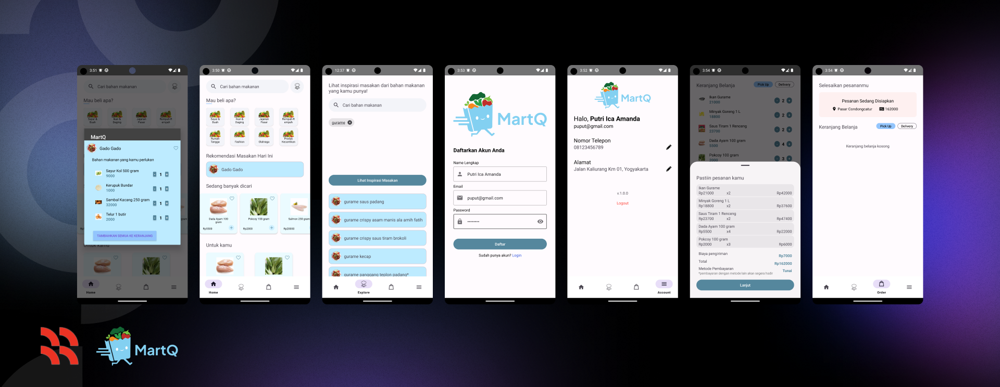

# Welcome to MartQ!
MartQ is set to revolutionize traditional market shopping by offering a convenient platform designed to provide users with:
- 🍲 **Diverse Culinary Inspiration**
- 🌽 **Reducing Food Waste**
- 🛍 **Affordable Freshness**

Watch the demo [here](https://drive.google.com/file/d/1vwcCY8AWuxdJw4w4amz6jp0VTM5q7l4L/view?usp=sharing).

## Features
- **Effortless Product Selection:** Easily pick your desired products without market concerns.
- **Culinary Inspiration:** Discover a variety of culinary ideas based on your pantry essentials.
- **Daily Recipe Recommendations:** Explore personalized recipe suggestions and seamlessly add the ingredients to your cart.

## How to Use
1. [Download APK.](https://drive.google.com/file/d/1-hp4fzYQMPO2mxwsWlWecoaJnG34Mr8-/view?usp=sharing)
2. Install the app on your Android device by following the on-screen instructions.
3. Make sure to enable installation from unknown sources in your device settings.
4. Enjoy!

## Version Information
Compile SDK Version: 34

Minimum SDK Version: 24

Target SDK Version: 33

Kotlin Version: 1.8

## Contact
For any inquiries or feedback, please contact the project team at [martq.bangkit@gmail.com](mailto:martq.bangkit@gmail.com)
